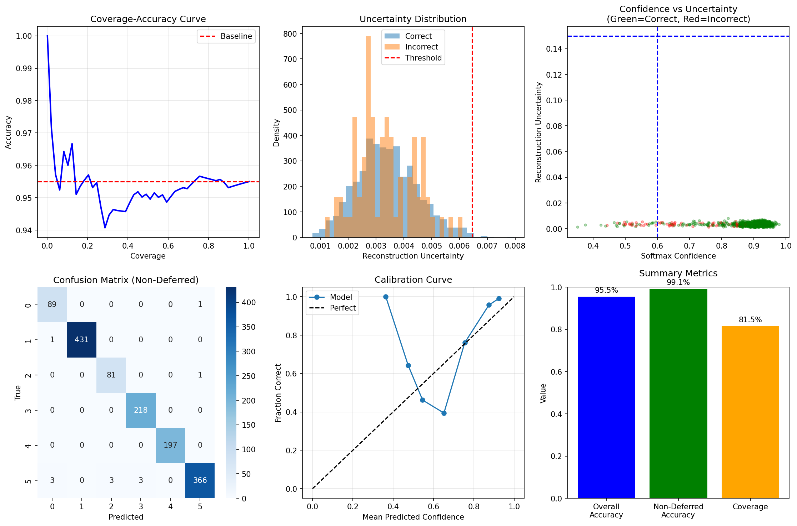
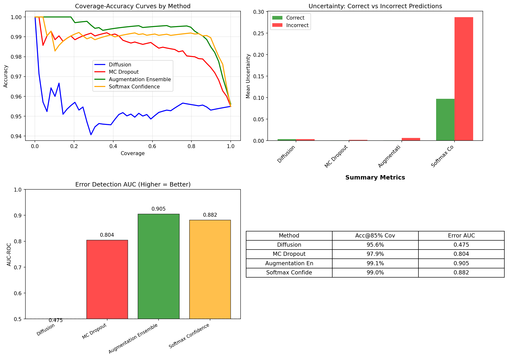
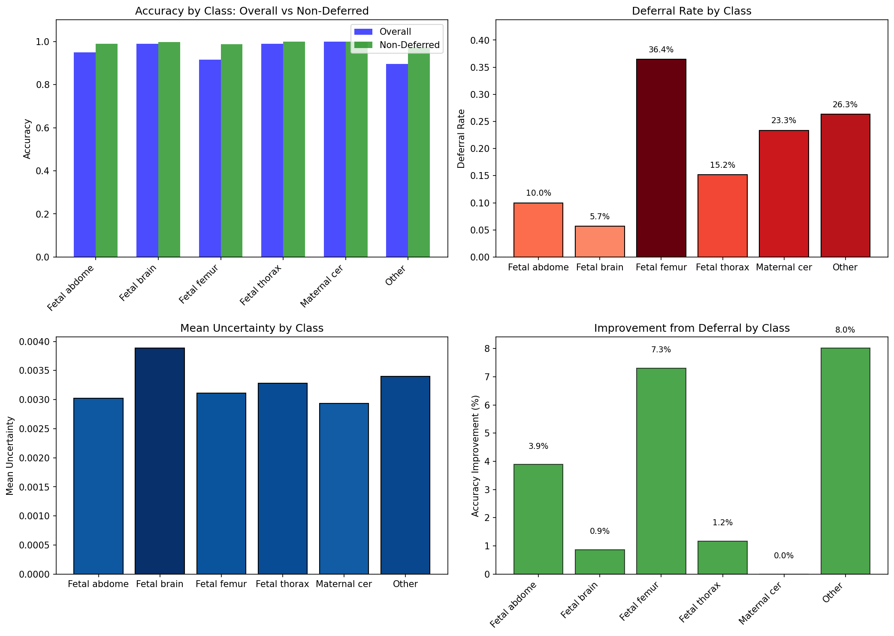
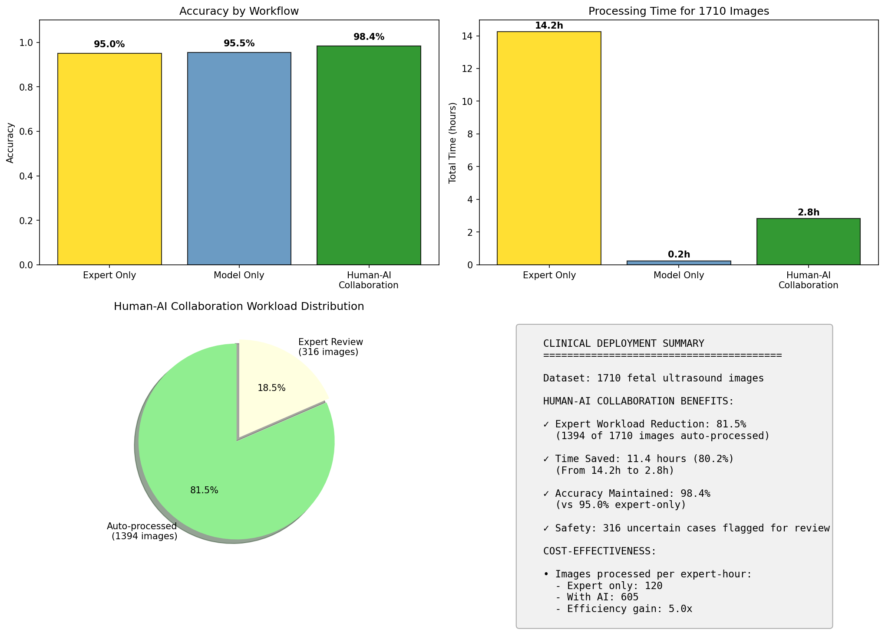

# Quality-Gated Fetal Ultrasound Classification

**Selective prediction for fetal ultrasound standard-plane classification, with a diffusion-based reconstruction-uncertainty signal and an honest ablation of when it helps.**

<p>
  
  
  
  
  
</p>

A ResNet-18 classifier is paired with two uncertainty signals — softmax confidence and diffusion reconstruction variance — and each image is either auto-accepted or deferred to a human expert based on thresholds calibrated for a target coverage. The repository is deliberately built around a clean result *and* a clean negative result: the deferral pipeline reaches **99.1% accuracy on accepted cases at 81.5% coverage**, while a controlled ablation shows the diffusion signal is the *weakest* of four uncertainty methods for error detection because the prior is out of domain. Both findings are reported in full.

---

## TL;DR

- **Task.** Classify six fetal ultrasound planes (abdomen, brain, femur, thorax, maternal cervix, other) with a *selective* option to abstain on hard cases.
- **Method.** Baseline classifier + diffusion reconstruction uncertainty + a confidence/uncertainty deferral gate, calibrated on validation for a target coverage.
- **Headline.** Accepting 81.5% of cases raises accuracy from 95.5% to 99.1%; a simulated human-AI workflow cuts expert workload by ~81% while holding ~98% accuracy.
- **Honest finding.** Reconstruction variance from an *out-of-domain* diffusion prior (CelebA-HQ faces) does **not** beat plain softmax confidence — its error-detection AUC (0.475) is near chance. A domain-trained diffusion model is the clear next step.

---

## Motivation

Fetal biometry and screening depend on acquiring the correct standard planes, and image quality varies widely across operators and machines. A model deployed in that setting is more useful if it can *abstain* on the cases it is likely to get wrong and route them to a sonographer, rather than forcing a confident label on every frame. This project studies exactly that abstention mechanism and asks a second, methodological question: is diffusion reconstruction uncertainty a good abstention signal, or do simpler signals do better?

---

## Method

```
Input image
   │
   ├─► ResNet-18 ──► softmax confidence ─┐
   │                                     ├─► defer if (conf < tau_c) OR (var > tau_u)
   └─► DDPM noise→denoise (MC samples) ──┘        │
              └─► reconstruction variance         ├─► accept ──► model label
                                                  └─► defer  ──► expert review
```

1. **Baseline classifier.** ResNet-18 with ImageNet transfer learning, trained with OneCycleLR, label smoothing, and gradient clipping.
2. **Diffusion reconstruction uncertainty.** A pretrained DDPM adds noise to an input at a fixed level and denoises it several times; the per-pixel variance across Monte Carlo reconstructions is the uncertainty score. High variance means the prior finds the image hard to reconstruct.
3. **Quality gate.** An image is deferred when confidence is below `tau_c` *or* reconstruction variance is above `tau_u`. Both thresholds are chosen by grid search on the validation set to maximize accuracy on accepted cases at a target coverage (default 85%).

---

## Results

### Selective prediction (test set)

| Metric | Value |
|---|---|
| Overall accuracy (no deferral) | 95.50% |
| Coverage (accepted) | 81.52% |
| Deferral rate | 18.48% |
| **Accuracy on accepted cases** | **99.14%** |
| Accuracy on deferred cases (would-be) | 79.43% |
| Net gain from deferral | +3.64% |
| Calibrated thresholds | conf 0.882, var 0.0064 |



### Uncertainty-method comparison — the result that matters most

| Method | Acc @ 85% coverage | Error-detection AUC |
|---|---|---|
| Augmentation ensemble | 99.1% | **0.905** |
| Softmax confidence | 99.0% | 0.882 |
| MC Dropout | 97.9% | 0.804 |
| **Diffusion (this work)** | 95.6% | **0.475** |



The diffusion reconstruction variance sits near chance (0.5) for separating correct from incorrect predictions, and is the weakest of the four signals. The deferral gains above are therefore driven almost entirely by the softmax-confidence threshold, not by the diffusion component. This is stated plainly rather than hidden, because the ablation is right there in the notebook and a credible repo should own it.

### Per-class deferral

The largest accuracy gains from deferral fall on the hardest classes — *Other* (+8.0%) and *Fetal femur* (+7.3%) — which also carry the highest deferral rates.



### Human-AI deployment simulation

Under the stated assumptions (expert 30 s/image, model 0.5 s/image, expert accuracy 95%), the collaborative workflow reduces expert workload by **81.5%** and processing time by **80.2%** while holding **98.4%** accuracy. These figures scale directly with the assumed expert accuracy and timing and should be read as illustrative.



---

## Key Finding / Main Limitation

The diffusion prior here is `google/ddpm-celebahq-256`, a face-generation model standing in for a fetal-ultrasound model that was not available. Reconstruction variance under an **out-of-domain prior** does not encode a meaningful in-domain quality signal, which explains both the near-chance error-detection AUC and the failed out-of-distribution detection (corruption-detection AUCs at or below 0.5 across Gaussian noise, blur, low contrast, random, and inverted inputs). The takeaway is specific and useful: reconstruction-based uncertainty needs a *domain-trained* diffusion model; with an off-domain prior, plain softmax confidence and a cheap augmentation ensemble dominate. Training or fine-tuning a fetal-US diffusion model is the single clearest next step.

---

## Repository Structure

```
quality-gated-fetal-ultrasound/
├── fetal_us_uncertainty.ipynb    # end-to-end notebook with executed outputs
├── config.py                     # loads configs/default.yaml into a Config object
├── configs/
│   └── default.yaml              # paths, hyperparameters, thresholds
├── src/
│   ├── data.py                   # dataset download, splits, transforms, loaders
│   ├── classifier.py             # ResNet-18 model + training loop
│   ├── diffusion_uncertainty.py  # reconstruction-variance estimator
│   ├── baselines.py              # MC Dropout, augmentation ensemble
│   ├── gating.py                 # quality-gated classifier + calibration
│   ├── evaluation.py             # metrics, plots, comparison, per-class
│   └── utils.py                  # seeding, denormalization
├── scripts/
│   └── run_experiment.py         # CLI entrypoint for the full pipeline
├── assets/                       # figures rendered in this README and more
├── requirements.txt
├── LICENSE
└── README.md
```

The notebook is the readable, output-carrying artifact; `src/` mirrors it as an importable package driven by `scripts/run_experiment.py`.

---

## Dataset

[FETAL_PLANES_DB](https://zenodo.org/records/3904280) (Burgos-Artizzu et al., 2020): 12,400 ultrasound images across six classes. The split is **patient-stratified** (~72.8% train / 13.4% val / 13.8% test) to prevent images from the same patient leaking across splits. The archive (~2.5 GB) is downloaded from Zenodo at runtime and is not committed to the repository.

---

## Installation

```bash
git clone https://github.com/Yogarajan12/quality-gated-fetal-ultrasound.git
cd quality-gated-fetal-ultrasound
python -m venv .venv && source .venv/bin/activate
pip install -r requirements.txt
```

A single L4/T4 GPU is sufficient; the workload is inference-heavy with minimal training.

## Usage

Run the full pipeline from the command line:

```bash
python scripts/run_experiment.py --config configs/default.yaml
```

Or open `fetal_us_uncertainty.ipynb` to step through data loading, training, uncertainty estimation, calibration, evaluation, and the extended analyses with inline figures. Either path downloads the dataset, trains the classifier, computes (or loads cached) uncertainties, calibrates thresholds, evaluates the gate, and writes figures plus `final_metrics.csv` to the output directory.

---

## Configuration

All paths and hyperparameters live in `configs/default.yaml` and are loaded by `config.py`; there are no environment-specific paths in the code. Key knobs: `data.image_size`, `train.num_epochs`, `diffusion.noise_levels`, `diffusion.num_uncertainty_samples`, `gating.target_coverage`, and `diffusion.prior_model` (swap this to point at a domain-trained diffusion model).

---

## Reproducibility

A global seed (42) is set for Python, NumPy, and PyTorch. Diffusion sampling remains stochastic across Monte Carlo reconstructions, so uncertainty values vary slightly between runs; cached `.npy` uncertainties are reused when present to keep evaluation deterministic.

---

## Roadmap

- Train or fine-tune a **fetal-ultrasound diffusion model** and re-run the comparison — the experiment that would make reconstruction uncertainty competitive.
- Add **temperature scaling** so the confidence signal is calibrated before thresholds are derived.
- Report **risk-coverage curves with confidence intervals** rather than point estimates.
- Add unit tests and a small CI workflow (lint + import check).
- Publish a short **model card** and **data-use statement** given the clinical framing.

---

## Citation

If this dataset is used, please cite the original authors:

```bibtex
@article{burgos2020fetalplanes,
  title   = {Evaluation of deep convolutional neural networks for automatic
             classification of common maternal fetal ultrasound planes},
  author  = {Burgos-Artizzu, Xavier P. and Coronado-Gutierrez, David and
             Valenzuela-Alcaraz, Brenda and Bonet-Carne, Elisenda and
             Eixarch, Elisenda and Crispi, Fatima and Gratacos, Eduard},
  journal = {Scientific Reports},
  volume  = {10},
  pages   = {10200},
  year    = {2020}
}
```

To reference this repository:

```bibtex
@misc{sivakumar2025qualitygated,
  author = {Sivakumar, Yogarajan},
  title  = {Quality-Gated Fetal Ultrasound Classification: Diffusion
            Reconstruction Uncertainty for Selective Prediction},
  year   = {2025},
  howpublished = {\url{https://github.com/Yogarajan12/quality-gated-fetal-ultrasound}}
}
```

---

## License

Released under the MIT License (see [`LICENSE`](LICENSE)). The FETAL_PLANES_DB dataset is governed by its own license on Zenodo; review it before redistribution.

## Acknowledgements

Built with PyTorch, Hugging Face `diffusers`, and scikit-learn. Dataset courtesy of BCNatal / Burgos-Artizzu et al.

---

*Research code for a methodological study only. This is not a medical device and is not validated for clinical use.*
